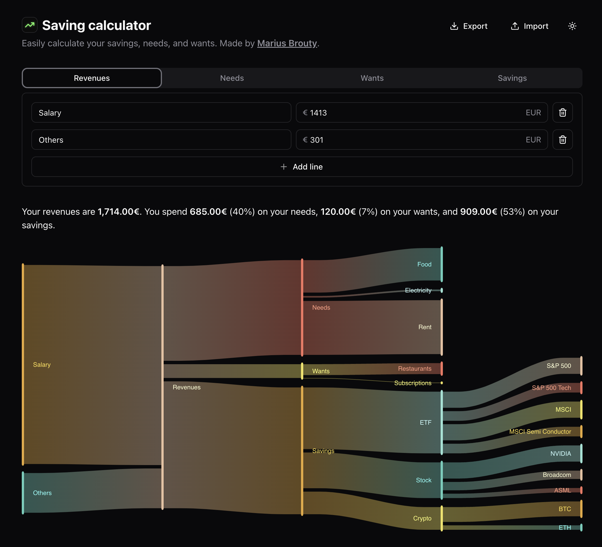

 

  

<h3 align="center">Saving calculator</h3>

  

A tool for calculating your savings
 
    <a href="https://investment.mariusbrt.com/"><strong>Test it now »</strong></a>
    

## About The Project

This tool allow you to automatically calculate your savings based on your monthly income and expenses.
Basically, you can input your monthly income, your monthly expenses and the tool will calculate your savings using
percentages.

### Built With

- Next.js
- Shadcn
- Tailwind CSS
- Nivo
- Zustand

## License

Distributed under the GNU GPLv3 License. See `LICENSE.txt` for more information.

## Contact

- [Portfolio](https://mariusbrt.com)
- [LinkedIn](https://www.linkedin.com/in/mariusbrt/)
